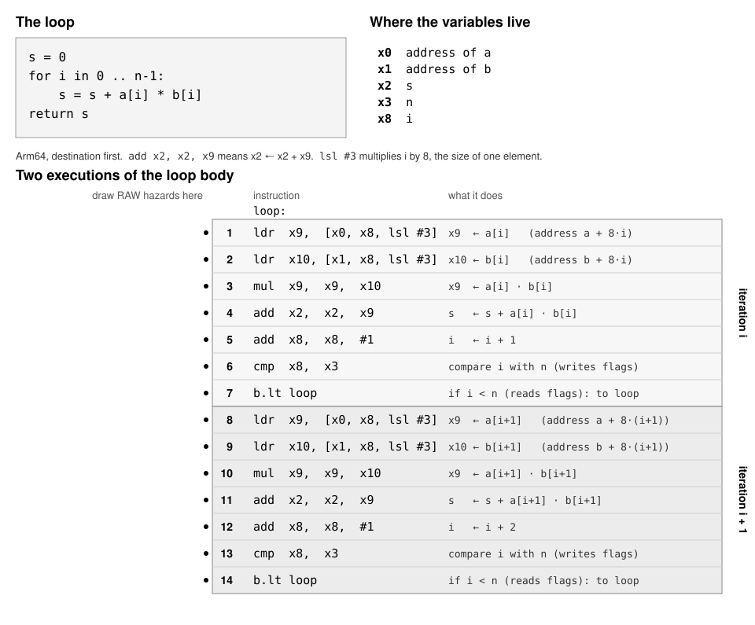

# Midterm Practice

## Problem 1: Straight-line code

A **RAW (read-after-write) dependency** exists when one instruction reads a
value that an earlier instruction writes. It becomes a **hazard** when the
reader is ready to start but the value is not ready yet, so the pipeline
stalls.

Assume:

  * an add takes **1 cycle** and a multiply takes **3 cycles** before its
    result can be used
  * the core starts at most one instruction per cycle, **in the order
    written**
  * an instruction cannot start until all of its inputs are ready

```
1.  x = a + b
2.  y = x * 2
3.  w = y + 1
4.  z = c + d
5.  v = z * 2
```

**(a)** List every RAW dependency as a pair "producer → consumer", and name the
variable that carries it.

**(b)** In which cycle does each instruction start? Which instructions stall,
and for how many cycles? In which cycle are all five results ready?

**(c)** Reorder the five instructions, without changing what any of them
computes, so that there are no stalls. How many cycles does your order take?
An out-of-order core does this reordering for you. What does it need to know
about the instructions to do it safely?

## Problem 2: Loops

Use the same latencies: add 1 cycle, multiply 3 cycles. Assume an out-of-order
core that can work on several iterations at once, so the only thing that makes
an iteration wait is a value it needs from an **earlier iteration**.

```
(a)  for i in 0 .. n-1:   b[i] = 2 * a[i] + 1
(b)  for i in 0 .. n-1:   x = x * a[i]
(c)  for i in 1 .. n-1:   c[i] = a[i] + a[i-1]
(d)  for i in 1 .. n-1:   p[i] = p[i-1] + a[i]
```

For each loop:

**(i)** Does it have a RAW dependency from one iteration to the next? If so,
which variable carries it?

**(ii)** If it does, what is the fewest cycles per iteration the loop can
take, no matter how many execution units the core has?

**(iii)** Loop (c) reads an element from the previous iteration. Explain why
that is or is not a RAW hazard.

## Problem 3: RAW hazards in generated code

The figure shows a loop and the Arm64 instructions for two executions of its
body, with a note on each instruction saying what it does.



On the figure, draw an arrow from an instruction to a later instruction for
each RAW hazard: a place where the later instruction must stall, waiting for a
value the earlier one writes. Assume an out-of-order core.

## Problem 4: Optimization levels

Activity 1 compared two ways of multiplying together all the elements of an
array of integers:

```
one accumulator                     four accumulators

x = 1                               x0 = x1 = x2 = x3 = 1
for i in 0 .. N-1 step 4:           for i in 0 .. N-1 step 4:
    x = x * a[i]                        x0 = x0 * a[i]
    x = x * a[i+1]                      x1 = x1 * a[i+1]
    x = x * a[i+2]                      x2 = x2 * a[i+2]
    x = x * a[i+3]                      x3 = x3 * a[i+3]
return x                            return x0 * x1 * x2 * x3
```

You measured both at each optimization level:

| Level | One chain | Four chains | Speedup |
|---|---|---|---|
| `-O0` | 140 ms | 99 ms | 1.4x |
| `-O1` | 67 ms | 17 ms | 3.9x |
| `-O2` | 67 ms | 17 ms | 3.9x |
| `-O3` | 67 ms | 17 ms | 3.9x |

**(a)** Why is the speedup so much smaller at `-O0`?

**(b)** The one-chain time does not change from `-O1` to `-O3`. Did the
compiler split the chain into accumulators for you? Is it allowed to? What
does this tell you about which optimizations you have to do yourself?

**(c)** `-O2` adds the auto-vectorizer, which `-O1` does not run. Why could it
not vectorize the one-accumulator loop?

## Problem 5: What makes a branch predictable?

This loop counts how many elements of an array `x` pass a test:

```
count = 0
for i in 0 .. n-1:
    if TEST:
        count = count + 1
```

`x` holds `n` = 32 million integers between 0 and 255, in random order. The
loop is run four times, each with a different `TEST`:

| | `TEST` | Meaning |
|---|---|---|
| 1 | `i % 2 == 0` | `i` is even |
| 2 | `x[i] % 2 == 1` | the value `x[i]` is odd |
| 3 | `x[i] < 250` | the value `x[i]` is less than 250 |
| 4 | `i < n / 2` | `i` is in the first half of the array |

**(a)** For each test, about what fraction of the time is the branch taken?
Which tests will the branch predictor get wrong often, and why?

**(b)** Tests 1 and 2 are both taken half the time, but only one of them is hard
to predict. What is the difference?

**(c)** A misprediction costs about 20 cycles on a 4 GHz core. Estimate how much
extra time the hard-to-predict test adds over all 32 million elements.

**(d)** Here are the measured times:

| | `TEST` | Time |
|---|---|---|
| 1 | `i % 2 == 0` | 7.5 ms |
| 2 | `x[i] % 2 == 1` | 79 ms |
| 3 | `x[i] < 250` | 13.0 ms |
| 4 | `i < n / 2` | 7.5 ms |

How close was your estimate in (c)? Test 3 is predicted correctly about 98% of
the time, yet it is noticeably slower than tests 1 and 4. Why?

## Problem 6: Branch or no branch?

Training a classifier such as logistic regression adds up a gradient. In one
step, each sample `i` contributes to the gradient for class `c` only if its
label is `c`. Each sample has 4 features `x[i][0..3]` and an error term
`err[i]`.

The `if` version:

```
for i in 0 .. n-1:
    if label[i] == c:
        for j in 0 .. 3:
            grad[j] = grad[j] + err[i] * x[i][j]
```

The branch-free version. `m` is 1 if the label matches and 0 if not, computed
without a branch:

```
for i in 0 .. n-1:
    m = (label[i] == c) ? 1 : 0
    for j in 0 .. 3:
        grad[j] = grad[j] + m * err[i] * x[i][j]
```

There are `n` = 1 million samples, in random order. Each version is run on two
data sets: one with **balanced** classes, where half the samples have label
`c`, and one with **skewed** classes, where only 10% have label `c` and the
other 90% have the other label.

| Classes | `if` version | branch-free |
|---|---|---|
| balanced (50% are `c`) | 3.1 ms | 2.65 ms |
| skewed (10% are `c`) | 0.82 ms | 2.6 ms |

**(a)** With skewed classes, about how often does the branch predictor guess
the `if` correctly? Why is the `if` version about 3 times faster than the
branch-free version?

**(b)** With balanced classes, why does the branch-free version win?

**(c)** Suppose each sample had 16 features instead of 4, with balanced
classes. Which version would you expect to be faster? Why?

## Problem 7: The reorder buffer and distance

The core can only reorder instructions that are in the reorder buffer at the
same time. Suppose it holds about 600 instructions.

This loop looks up values in a 1 GB table at random positions, so almost every
`table[idx[i]]` misses the caches and waits about 500 cycles for memory. Each
iteration also calls a function `f`, which does not use the loaded value:

```
for i in 0 .. n-1:
    total = total + table[idx[i]]    # likely a cache miss: about 500 cycles
    f(i)
```

The lookups are independent of each other: each address comes from `idx`, not
from an earlier lookup.

**(a)** Suppose `f` is small, about 20 instructions. About how many iterations
fit in the reorder buffer at once? What does that mean for the cache misses?

**(b)** Now suppose `f` is big, about 2,000 instructions. What happens to the
reorder buffer while one lookup waits for memory? How many lookups can be
waiting for memory at the same time?

**(c)** With the big `f`, how could you restructure the code so that the
lookups overlap again?

## Problem 8: How far away is the data?

**(a)** Fill in the approximate time, in cycles, for one read from each place
a value can be, on the machine from class.

| Where the value is | Size | Latency (cycles) |
|---|---|---|
| register | a few bytes | |
| L1 cache | 48 KB | |
| L2 cache | 1 MB | |
| L3 cache | 16 MB | |
| memory (DRAM) | many GB | |

**(b)** For each example, say where the marked read most likely finds its
value, and about how many cycles the read takes. Below each example is the loop as
clang compiles it for x86-64 at `-O1`, in Intel syntax (destination first), with
the marked read pointed out.

Example 1: a counter.

```
count = 0
for i in 0 .. n-1:
    count = count + 1            # read count
```

```
loop:                            ; count in rax, n in rdi
    inc   rax                    ; count = count + 1   <-- reads count
    dec   rdi                    ; one fewer to go
    jne   loop
```

Example 2: a small table of 16 values, looked up over and over.

```
for i in 0 .. n-1:
    y[i] = table[x[i] % 16]      # read table[...]
```

```
loop:                                       ; y in rdi, x in rsi, table in rdx, i in rax
    mov   r8d, dword ptr [rsi + 4*rax]      ; r8 = x[i]
    and   r8d, 15                           ; r8 = x[i] % 16
    movsd xmm0, qword ptr [rdx + 8*r8]      ; xmm0 = table[x[i] % 16]   <-- reads table
    movsd qword ptr [rdi + 8*rax], xmm0     ; y[i] = xmm0
    inc   rax                               ; i = i + 1
    cmp   rcx, rax                          ; i == n?  (n in rcx)
    jne   loop
```

Example 3: a linked list of 10 million nodes, scattered at random through
1 GB of memory. Each node is visited once.

```
p = first node
while p is not the end:
    total = total + p.value
    p = p.next                   # read p.next
```

```
loop:                                       ; p in rdi, total in xmm0
    addsd xmm0, qword ptr [rdi]             ; total = total + p.value
    mov   rdi, qword ptr [rdi + 8]          ; p = p.next   <-- reads p.next
    test  rdi, rdi                          ; is p null (the end)?
    jne   loop
```

## Problem 9: Hardware prefetching

This loop adds up elements of an array `data`, reading them in the order given
by a second array, `idx`:

```
sum = 0
for i in 0 .. n-1:
    sum = sum + data[idx[i]]
```

`data` holds doubles and is 256 MB, far larger than the caches. The loop does
`n` = 4 million loads. It is run three times with the same code; only the
values in `idx` change:

| | `idx` holds | ns per load |
|---|---|---|
| 1 | in order: 0, 1, 2, 3, ... | 0.53 |
| 2 | every 8th element: 0, 8, 16, 24, ... | 0.82 |
| 3 | one element from every cache line, the lines in random order | 2.9 |

A cache line is 64 bytes, so it holds 8 doubles. In patterns 2 and 3, every
load is to a different cache line.

**(a)** Patterns 2 and 3 read exactly the same cache lines from memory, just in
a different order. Why is pattern 3 about 3.5 times slower?

**(b)** Why is pattern 1 faster still than pattern 2?
